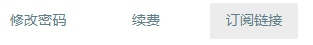
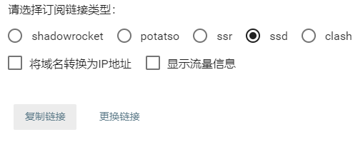
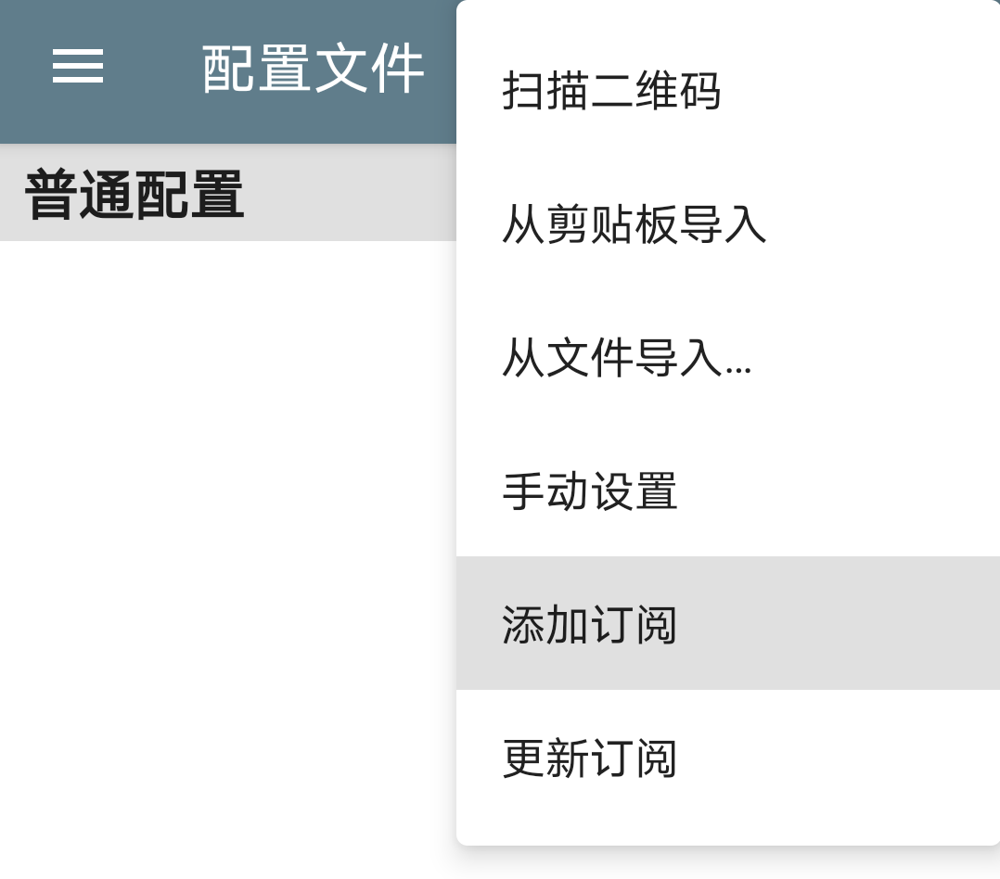
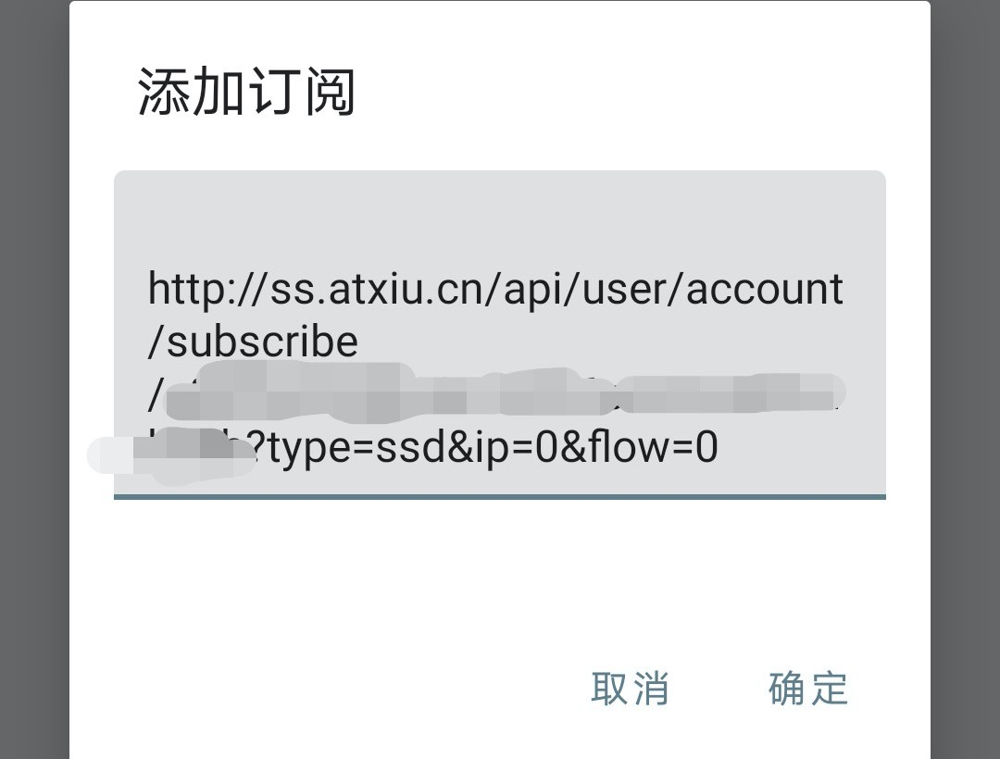
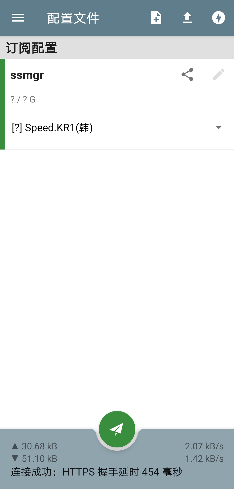
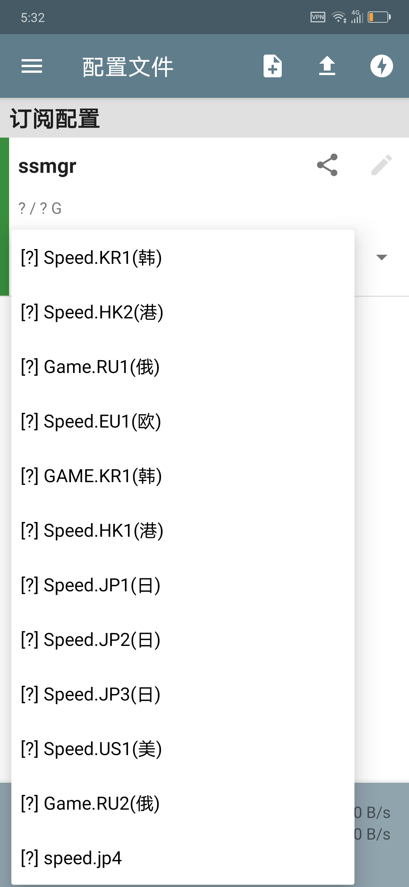

# Android 平台 SSD 客户端使用教程

1. 打开管理门户后，点击账号进入账号页面，然后在下面找到订阅链接按钮。

2. 在弹出的菜单中选中 **ssd** 类型，点击下方复制链接按钮。

3. 打开 ssd 客户端，点击右上角 **+** 号，选择添加订阅

4. 在弹出框内粘贴复制的链接，点击确定按钮

5. 点击我们添加的订阅，然后点击下方纸飞机图标，即可开启代理。

6. 更换节点，点击节点右侧下箭头，可以选择节点。

