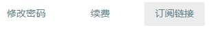

# Mac 平台 ClashX 客户端使用教程

1.打开管理门户后，点击账号进入账号页面，然后在下面找到订阅链接按钮。

2.在弹出的菜单中选中 **clash** 类型，点击下方复制链接按钮。

3.打开 ClashX 程序，点击右上角猫型图标，选择配置-托管配置-管理。

4.点击下方添加按钮，在弹出框内 url: 后面的输入框中将之前复制的链接粘贴上去，点击确定按钮。

5.启动代理，点击猫型图标，点击设置为系统代理。

6.切换节点，点击猫型图标，在Proxy中选择节点。

