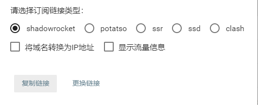
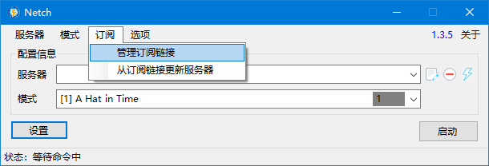
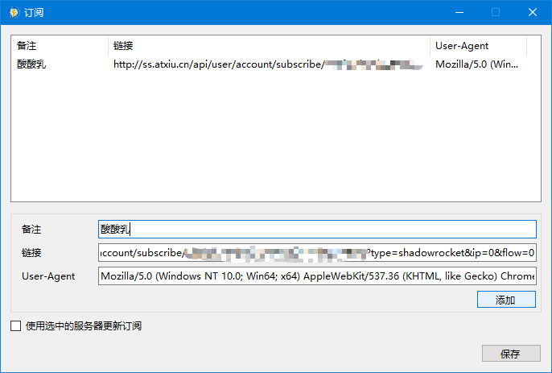
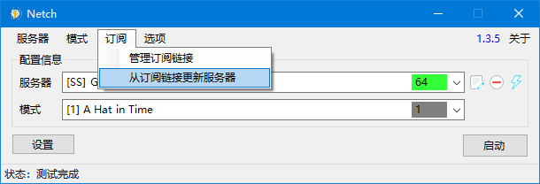
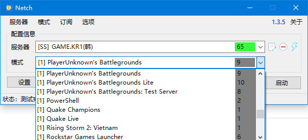
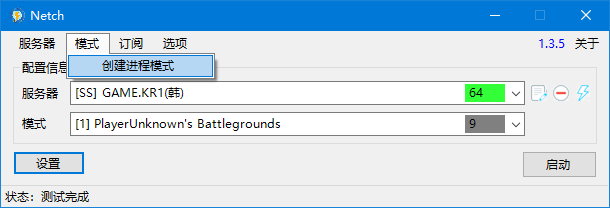
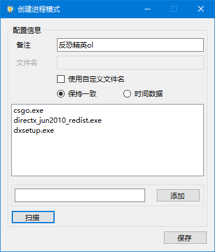
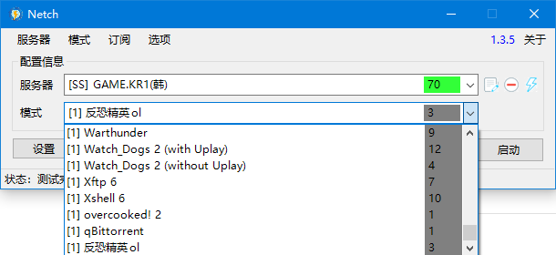

# Windows 平台 游戏加速器 Netch 使用教程

 1. 打开管理门户后，点击账号进入账号页面，然后在下面找到订阅链接按钮。

2. 在弹出的菜单中选中 **shadowrcoket** 类型，点击下方复制链接按钮。

3. 打开 Netch 客户端,点击上方订阅菜单，点击管理订阅链接子菜单。

4. 在备注中随便输入一些内容，然后把之前复制的链接复制进链接后面的输入框内。点击下方添加按钮，等添加成功后再点击右下角保存按钮。

5. 此时回到主界面，点击上方订阅菜单，点击从订阅链接更新服务器子菜单。

6. 在服务器右侧选择栏中可以切换节点，右侧闪电按钮可以测试节点延迟。订阅到此已完成，接下来加速游戏，Netch内置了一些规则，可以在模式中选择，例如我们想要加速吃鸡，只需要选中吃鸡的规则即可，然后点击右侧启动。启动成功后，就可以打开游戏了。(只推荐使用Game开头节点进行游戏)

7. 如果我想玩的游戏规则中没有怎么办呢，也很简单，回到主界面，点击上方模式菜单，点击创建进程模式子菜单

8. 输入你能看懂的游戏名字。点即下方扫描，弹出选择框，选中游戏根目录，它会自己扫描exe文件并加入上方空白框内，然后点击右下角保存按钮。

9. 回到主界面后，模式框拉到最下面就可以看到自己添加的规则了。

