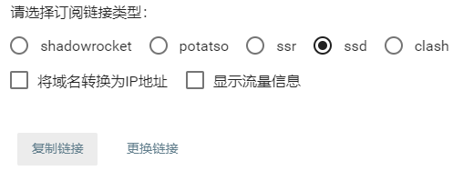
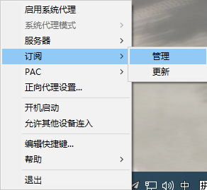
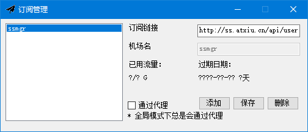
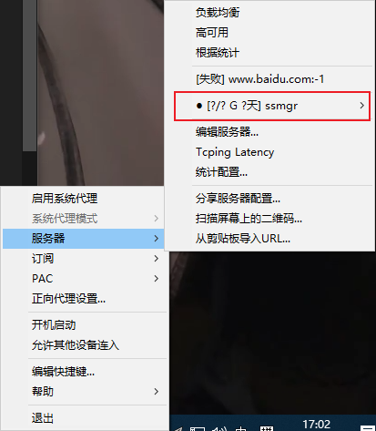
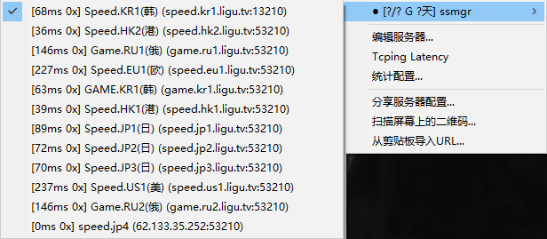

#Windows 平台 SSD 客户端使用教程

 1. 打开管理门户后，点击账号进入账号页面，然后在下面找到订阅链接按钮。

 2. 在弹出的菜单中选中 **ssd** 类型，点击下方复制链接按钮。

 3. 打开 ssd 客户端，默认是不弹出界面，需要去右下角找到纸飞机图标，然后在图标上右键。找到订阅-管理位置并单击

 4. 这时将之前复制到的链接粘贴进**订阅链接**后面的输入框内，点击下方添加按钮，左侧会出现已添加内容，此时点右上角X关掉此界面。

 5. 此时订阅已经添加好了，我们再次找到纸飞机图标右键，找到服务器-添加的平台名子分类

 6. 在这一步看到订阅的节点都在这里了，我们选择一个自己喜欢的节点点击，这里我选择了Speed.KR1(韩)，以后切换节点可以重复5、6步骤。

 7. 再次找到纸飞机图标右键，点击启用系统代理即可启用代理。